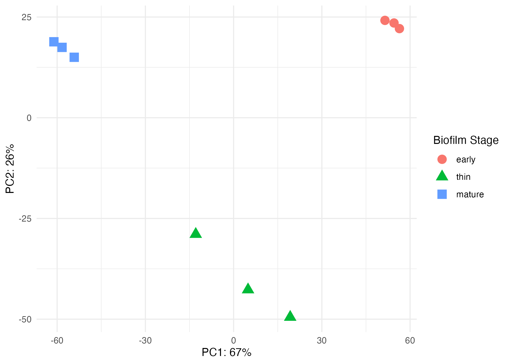
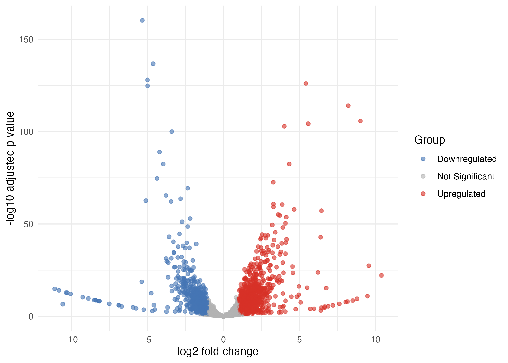
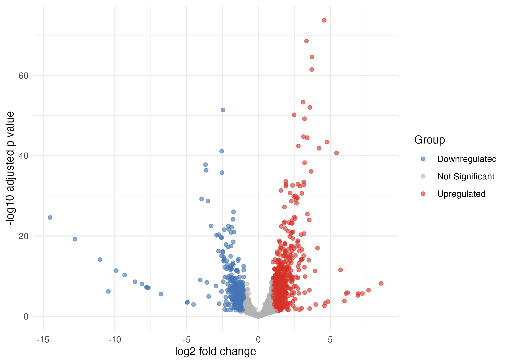
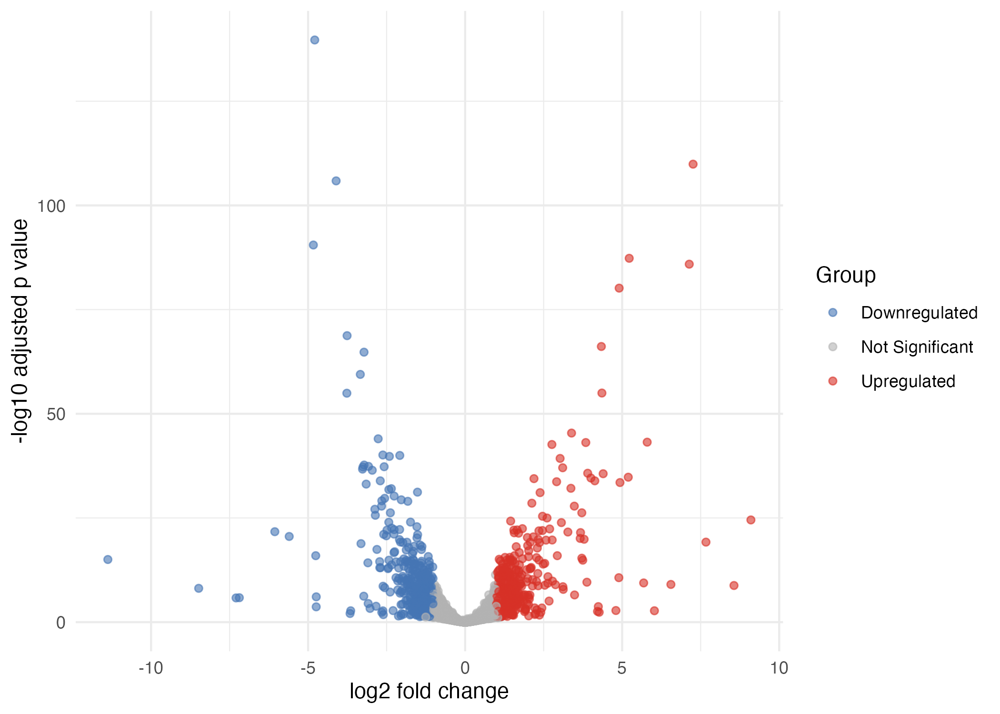
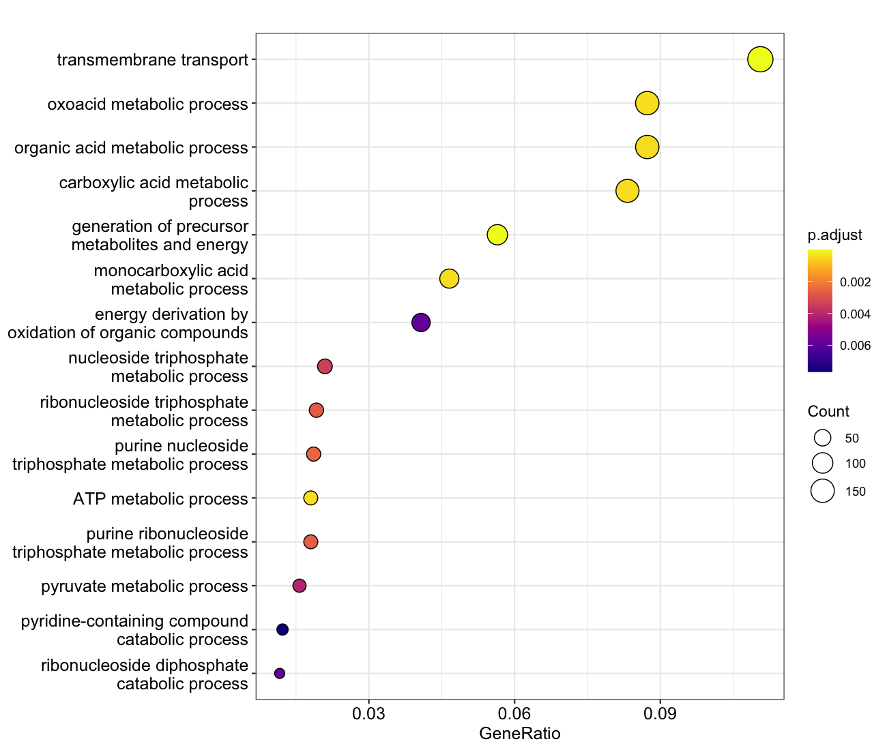
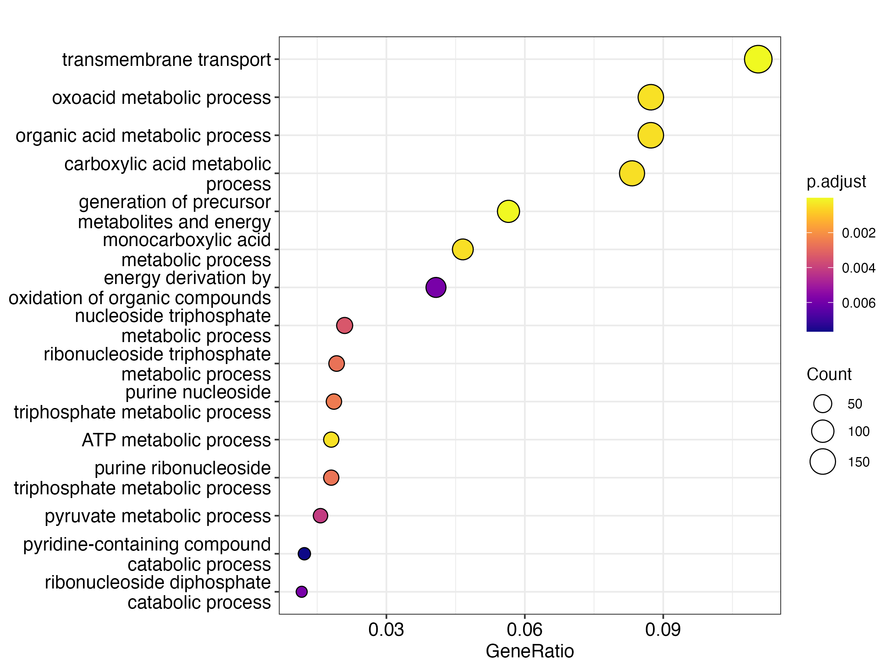
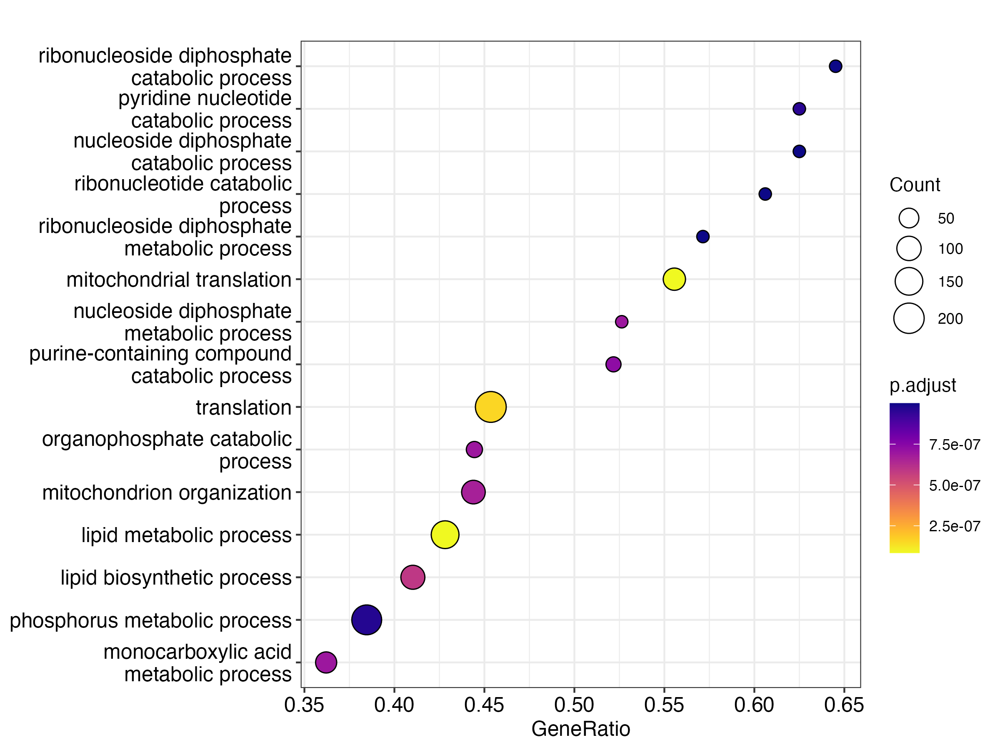

## Introduction:
Flor yeasts of *Saccharomyces cerevisiae* play a central role in the biological aging of sherry-style wines. During this process, specialized yeast strains form a floating biofilm, or velum, at the air–liquid interface of fortified wine. This biofilm develops after alcoholic fermentation, when fermentable sugars are depleted and oxidative conditions prevail. Under these conditions, flor yeasts shift from fermentative growth to oxidative metabolism and utilize ethanol and glycerol as carbon sources. The progression from early biofilm formation to a mature velum represents a structured developmental process associated with physiological and transcriptional changes.1

Although the metabolic characteristics of flor yeast during biological aging have been described, understanding the regulatory mechanisms underlying stage-specific biofilm development requires genome-wide characterization of gene expression.1 High-throughput RNA sequencing enables quantitative analysis of transcript abundance across experimental conditions and facilitates identification of differentially expressed genes and enriched biological pathways.2 Comparative transcriptomic analysis of early, thin, and mature biofilm stages therefore provides a framework for identifying molecular processes associated with velum maturation and adaptation to oxidative wine-aging conditions.1

Transcript abundance was estimated using Salmon, which employs lightweight alignment of reads to reference transcripts rather than traditional full-length alignment.3 Similar to pseudoalignment approaches such as Kallisto, this strategy enables computationally efficient transcript quantification.3,4 However, Salmon additionally incorporates sequence-specific and GC-content bias correction within its statistical framework for abundance estimation.3

Several statistical methods have been developed for differential expression analysis of RNA-seq data, including DESeq2 and edgeR.5,6 Both approaches model sequencing counts using the negative binomial distribution. DESeq2 estimates gene-wise dispersion and applies shrinkage to dispersion and fold change estimates, which improves the stability of differential expression results.5 For this reason, DESeq2 was selected for analysis of biofilm developmental stages.

The objective of this study was to characterize differential gene expression across early, thin, and mature stages of flor biofilm development and to identify biological processes associated with velum maturation. By integrating transcript quantification, differential expression analysis, and functional enrichment, this study aimed to define transcriptional programs underlying flor yeast adaptation during biological wine aging.

## Methods:
All command-line analyses were executed within Docker containers to ensure reproducibility and version control. 
### Data Acquisition
RNA sequencing data from *S. cerevisiae* flor biofilm development (BioProject PRJNA592304) were downloaded from the NCBI Sequence Read Archive using SRA Toolkit. The prefetch and fasterq-dump tools were used to retrieve and convert SRA files to FASTQ format.7 A reference transcript FASTA file and corresponding GTF annotation for the S288C R64 assembly were obtained from NCBI RefSeq.
### Quality Control
Raw sequencing reads were assessed using FastQC v0.12. and quality reports were aggregated using MultiQC v1.21 to evaluate per-base sequence quality, GC content, and adapter contamination across samples.8
### Transcript Quantification
Transcript abundance was estimated using Salmon v1.10.3 in quasi-mapping mode with selective alignment enabled using `--validateMappings`.3 An index was constructed from the reference transcript FASTA file using salmon index, and no decoy sequences were incorporated during indexing. Quantification was performed using salmon quant with automatic library type detection specified by `--l A`.9 Transcript-level abundance estimates were written to individual quant.sf files for each sample. A sample import table linking sample identifiers to quantification files was generated for downstream analysis.
### Gene-Level Summarization and Differential Expression Analysis 
Transcript-level quantification files were imported into R v4.5.1 using tximport with input type specified as `"salmon"`. Transcript-to-gene mappings were derived from the GTF annotation, with transcript version suffixes ignored to ensure identifier consistency.9
Differential expression analysis was performed using DESeq2 with the design specified as `~ stage`. Genes with total counts ≤10 were removed pri or to modeling.5,9 Statistical significance was assessed using the Wald test under a negative binomial generalized linear model framework, applying an adjusted p value threshold of 0.05 in results. For the mature versus thin comparison, the stage factor was re-leveled and the model refit. Log2 fold changes were shrunken using `lfcShrink` with the `apeglm` method. Variance stabilizing transformation was applied using vst prior to PCA and visualization.
### Functional Enrichment Analysis
Functional enrichment analyses were conducted in R version 4.5.1 using `clusterProfiler`, `org.Sc.sgd.db`, `enrichplot`, and `DOSE`.
### Over-Representation Analysis (ORA)
ORA was performed using enrichGO. Significant genes were defined using an adjusted p value threshold of 0.05 and an absolute log2 fold change greater than 1. The background gene universe consisted of all genes retained following differential expression filtering. Gene identifiers were supplied in ORF format and mapped using `org.Sc.sgd.db`. Enrichment results were visualized using dotplot.10
### Gene Set Enrichment Analysis (GSEA)
GSEA was performed using gseGO on a ranked gene list ordered by shrunken log2 fold change values.11 A minimum gene set size of 10 and a maximum gene set size of 500 were applied. Statistical significance was determined using an adjusted p value threshold of 0.05. Enrichment direction was interpreted using normalized enrichment scores. Results were visualized using dotplot.

## Results
### Global Transcriptomic Structure
Principal component analysis (PCA) was performed on variance-stabilized (VST) normalized counts to assess global transcriptomic structure across early, thin, and mature biofilm stages. PC1 explained 67% of the total variance, while PC2 explained 26%. Samples clustered distinctly according to developmental stage, with early, thin, and mature biofilms forming well-separated groups along PC1. Samples from the same stage grouped tightly together, indicating that gene expression patterns were consistent within each stage. The clear separation between early and mature samples suggests substantial transcriptomic remodeling during biofilm maturation, while thin-stage samples occupied an intermediate position, consistent with a transitional developmental state (Figure 1).

  

  <em><strong>Figure 1.</strong> Figure 1. PCA of gene expression across early, thin, and mature biofilm stages. PC1 explains 67% of the total variation and PC2 explains 26%. Samples cluster by developmental stage, indicating clear differences in gene expression as the biofilm matures. Each point represents one biological replicate.</em>

### Differential Expression Overview
Differential expression analysis was performed between each pair of biofilm stages (early vs thin, early vs mature, and thin vs mature) using DESeq2 with log2 fold change shrinkage. The mature versus early comparison exhibited the greatest number and magnitude of transcriptional changes (Table 2). Volcano plots demonstrated widespread differential expression across biofilm stages (Figures 2). In all comparisons, most genes were centered near zero log2 fold change, indicating limited expression differences for most genes. However, the mature versus early contrast exhibited the greatest dispersion of fold changes and the highest number of significantly upregulated and downregulated genes. Comparatively, the mature versus thin and thin versus early comparisons displayed narrower and intermediate magnitudes of fold change, respectively.

  <em><strong>Table 1.</strong> Differentially Expressed Genes Across Biofilm Stages.</em>

| Expression Pattern | Regulation range (log2FC) | Thin vs Early | Mature vs Thin | Mature vs Early |
|-------------------|--------------------------|---------------|----------------|-----------------|
| Upregulated       | ≥ 2 (Up4)                | 92            | 135            | 294             |
|                   | 1 to < 2 (Up2)           | 296           | 496            | 657             |
| Downregulated     | -1 to > -2 (Dn2)         | 369           | 403            | 593             |
|                   | ≤ -2 (Dn4)               | 88            | 66             | 177             |
| **Total DEG**     | padj < 0.05              | **2226**      | **2394**       | **3015**        |

  

    <strong>A</strong> 
    
  

  

    <strong>B</strong> 
    
  

  

    <strong>C</strong> 
    
  

  <em><strong>Figure 2.</strong> Volcano plots showing differential gene expression between biofilm developmental stages. (A) Mature vs early, (B) mature vs thin, and (C) thin vs early comparisons. Each point represents one gene. The x-axis shows log₂ fold change in expression, and the y-axis shows the −log₁₀ adjusted p-value. Red points indicate significantly upregulated genes, blue points indicate significantly downregulated genes, and grey points represent genes that are not statistically significant. The mature vs early comparison (A) shows the largest spread of fold changes, indicating the greatest overall transcriptional difference between stages.
</em>

### Specific Gene Examples
Several genes showed large magnitude log2 fold changes in the mature versus early comparison. YNR071C (log2FC = 9.01), YNR073C (log2FC = 8.21), and YIR019C (log2FC = 5.42) were among the most strongly upregulated genes in mature biofilms (padj < 10⁻¹¹⁵). Conversely, YJL052W (log2FC = −5.34), YGR087C (log2FC = −5.09), and YHR094C (log2FC = −4.99) were significantly downregulated relative to early biofilms (padj < 10⁻¹²⁵). These genes displayed opposing expression patterns between early and mature stages (Figure 3).

  

  <em><strong>Figure 3.</strong> Heatmap of the top 20 differentially expressed genes in the mature vs early comparison. Expression values were variance-stabilized and scaled by row. Each column represents one biological replicate, grouped by developmental stage (early, thin, and mature), and each row represents one gene. Warmer colors (red) indicate higher relative expression, and cooler colors (blue) indicate lower relative expression. Hierarchical clustering shows clear stage-specific expression patterns, with mature and early samples forming distinct clusters and thin samples displaying intermediate expression profiles.
.</em>

### Functional Enrichment 
Gene Ontology ORA was performed using significantly differentially expressed (DE) genes (padj < 0.05). The mature versus early comparison showed significant enrichment of transmembrane transport (190 genes; padj = 1.52 × 10⁻⁵), generation of precursor metabolites and energy (97 genes; padj = 2.71 × 10⁻⁵), and ATP metabolic process (31 genes; padj = 4.30 × 10⁻⁴). Additional enriched categories included organic acid metabolic process and oxoacid metabolic process (Figure 4).

  

  <em><strong>Figure 4.</strong> GO biological process enrichment for the mature vs early comparison. Dots represent enriched pathways, sized by the number of genes and colored by adjusted p-value. GeneRatio indicates the proportion of differentially expressed genes within each pathway. Metabolism- and transport-related processes are prominently enriched, consistent with metabolic adaptation during biofilm maturation. </em>

Gene Set Enrichment Analysis (GSEA) further identified significant enrichment of metabolism-associated GO biological process terms across the ranked gene list. Both positive and negative normalized enrichment scores were observed, reflecting coordinated upregulation and downregulation of gene sets between mature and early stages (Figure 5).

  

  <em><strong>Figure 5.</strong> Figure 6. GSEA results for the mature vs early comparison. Dots represent enriched GO biological processes, sized by gene count and colored by adjusted p-value. GeneRatio reflects the proportion of genes contributing to each pathway. Enrichment of translation-, mitochondrial-, and metabolism-related processes.<em>

## Discussion 
During biological wine aging, flor yeasts develop from early surface attachment into a stable biofilm (velum) at the air–liquid interface. The transcriptomic data show that this progression is accompanied by clear and stage-specific changes in gene expression (Figure 1). Principal component analysis separated early, thin, and mature samples, with thin samples positioned between early and mature stages, supporting a gradual transition rather than an abrupt shift.

The largest transcriptional changes occurred between mature and early stages (Table 1 and Figure 2). Volcano and MA plots show both strong upregulation and downregulation of many genes, indicating coordinated regulation rather than random variation. In yeast, coordinated induction of some genes alongside repression of others has been described as a common response to environmental change.12 The bidirectional expression patterns observed here are consistent with this type of global transcriptional adjustment during biofilm maturation.

At the gene level, YIR019C (FLO11) was strongly upregulated in mature biofilms (Figure 3). FLO11 encodes a cell surface protein required for adhesion and biofilm formation in S. cerevisiae.13 Increased expression of FLO11 in mature samples is consistent with stabilization of the velum structure at the wine surface, where cell adhesion is essential. Other genes showed strong downregulation in mature relative to early stages (Figure 4), further supporting that velum maturation involves defined regulatory changes.

Functional enrichment analysis helps explain these patterns. Over-representation analysis identified enrichment of transmembrane transport and energy-related processes, including ATP metabolic and organic acid metabolic pathways (Figure 5). Gene Set Enrichment Analysis showed similar patterns across the ranked gene list (Figure 6). Agreement between these approaches suggests that many genes involved in metabolism change together during maturation.

These results align with known flor yeast physiology. After fermentation, flor yeasts shift from fermentative growth to oxidative metabolism under nutrient-limited conditions.1,14 Oxygen exposure at the air–liquid interface promotes respiratory activity, and proteomic studies have reported increased abundance of mitochondrial and respiration-associated proteins during biofilm development.15 Enrichment of transport-related processes suggests that mature biofilms adjust nutrient uptake and metabolite exchange as the velum structure develops.

Overall, integration of global expression patterns (Figure 1), differential expression (Figure 2), gene-level changes (Figure 3), and pathway enrichment (Figures 4 and 5) indicates that velum maturation represents a structured developmental process driven by coordinated metabolic adaptation that supports survival during biological wine aging.
## References
1.	Mardanov AV, Eldarov MA, Beletsky AV, Tanashchuk TN, Kishkovskaya SA, Ravin NV. Transcriptome Profile of Yeast Strain Used for Biological Wine Aging Revealed Dynamic Changes of Gene Expression in Course of Flor Development. Front Microbiol. 2020 Apr 3;11. doi:10.3389/fmicb.2020.00538

2.	Wang Z, Gerstein M, Snyder M. RNA-Seq: a revolutionary tool for transcriptomics. Nat Rev Genet. 2009 Jan;10(1):57–63. doi:10.1038/nrg2484

3.	Patro R, Duggal G, Love MI, Irizarry RA, Kingsford C. Salmon provides fast and bias-aware quantification of transcript expression. Nat Methods. 2017 Apr;14(4):417–9. doi:10.1038/nmeth.4197
4.	Bray NL, Pimentel H, Melsted P, Pachter L. Near-optimal probabilistic RNA-seq quantification. Nat Biotechnol. 2016 May;34(5):525–7. doi:10.1038/nbt.3519

5.	Love MI, Huber W, Anders S. Moderated estimation of fold change and dispersion for RNA-seq data with DESeq2. Genome Biol. 2014;15(12):550. doi:10.1186/s13059-014-0550-8 PubMed PMID: 25516281; PubMed Central PMCID: PMC4302049.

6.	Robinson MD, McCarthy DJ, Smyth GK. edgeR: a Bioconductor package for differential expression analysis of digital gene expression data. Bioinformatics. 2010 Jan 1;26(1):139–40. doi:10.1093/bioinformatics/btp616

7.	GitHub [Internet]. [cited 2026 Mar 1]. HowTo: fasterq dump. Available from: https://github.com/ncbi/sra-tools/wiki/HowTo:-fasterq-dump

8.	hbctraining/Intro-to-rnaseq-hpc-salmon [HTML] [Internet]. Teaching materials at the Harvard Chan Bioinformatics Core; 2025 [cited 2026 Mar 1]. Available from: https://github.com/hbctraining/Intro-to-rnaseq-hpc-salmon

9.	Griffith M, Walker JR, Spies NC, Ainscough BJ, Griffith OL. Informatics for RNA Sequencing: A Web Resource for Analysis on the Cloud. Ouellette F, editor. PLoS Comput Biol. 2015 Aug 6;11(8):e1004393. doi:10.1371/journal.pcbi.1004393

10.	Rivals I, Personnaz L, Taing L, Potier MC. Enrichment or depletion of a GO category within a class of genes: which test? Bioinformatics. 2007 Feb 15;23(4):401–7. doi:10.1093/bioinformatics/btl633

11.	Yu G, Wang LG, Han Y, He QY. clusterProfiler: an R Package for Comparing Biological Themes Among Gene Clusters. OMICS: A Journal of Integrative Biology. 2012 May;16(5):284–7. doi:10.1089/omi.2011.0118

12.	Gasch AP, Spellman PT, Kao CM, Carmel-Harel O, Eisen MB, Storz G, et al. Genomic Expression Programs in the Response of Yeast Cells to  Environmental Changes. Mol Biol Cell. 2000 Dec;11(12):4241–57. doi:10.1091/mbc.11.12.4241 PubMed PMID: 11102521; PubMed Central PMCID: PMC15070.

13.	Lo WS, Dranginis AM. The Cell Surface Flocculin Flo11 Is Required for Pseudohyphae Formation and Invasion by Saccharomyces cerevisiae. Mol Biol Cell. 1998 Jan;9(1):161–71. doi:10.1091/mbc.9.1.161 PubMed PMID: 9436998; PubMed Central PMCID: PMC25236.

14.	David-Vaizant V, Alexandre H. Flor Yeast Diversity and Dynamics in Biologically Aged Wines. Front Microbiol. 2018 Sep 25;9:2235. doi:10.3389/fmicb.2018.02235 PubMed PMID: 30319565; PubMed Central PMCID: PMC6167421.

15.	Moreno-García J, Mauricio JC, Moreno J, García-Martínez T. Differential Proteome Analysis of a Flor Yeast Strain under Biofilm Formation. Int J Mol Sci. 2017 Mar 28;18(4):720. doi:10.3390/ijms18040720 PubMed PMID: 28350350; PubMed Central PMCID: PMC5412306.

